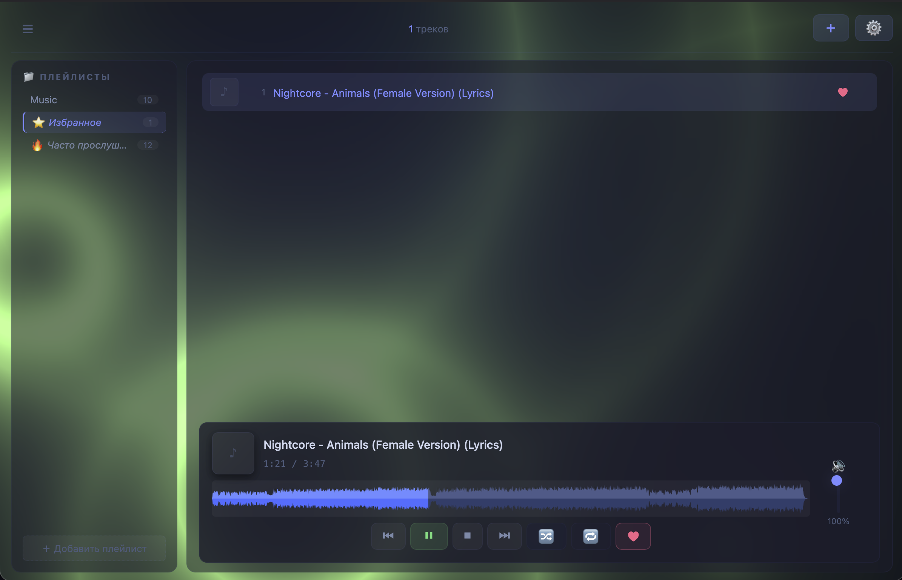
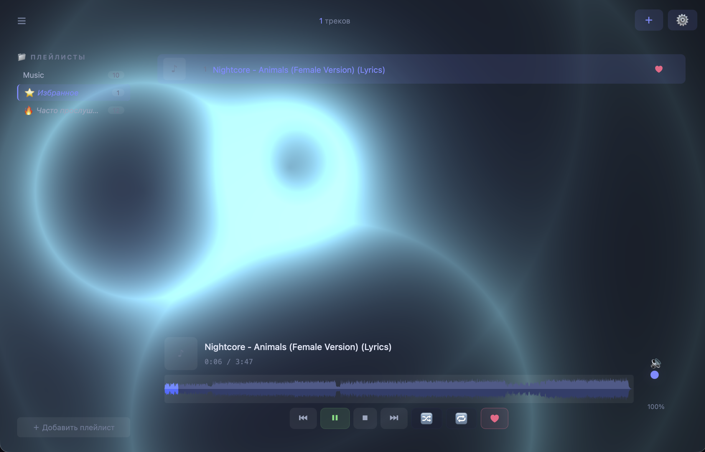

# ✦ MusicPlayer

Музыкальный плеер для macOS, написанный на Python + pywebview + VLC. Сделан под себя, потому что встроенный плеер macOS не устраивал.

---

## Возможности

- Воспроизведение всех популярных аудиоформатов через libvlc
- Плейлисты с поддержкой drag & drop
- Виртуальные плейлисты «Избранное» и «Часто прослушиваемое» на основе метаданных
- 10-полосный эквалайзер с пресетами и пользовательскими профилями
- Waveform с кэшированием (мгновенное переключение между треками)
- Обложки из тегов с кэшированием
- **Фоновый WebGL-визуализатор** — волны реагируют на громкость музыки
- **Две темы оформления:** «Стандартная» (с панелями) и «Magic» (прозрачные панели, только текст и волны)
- Настраиваемый акцентный цвет: 12 готовых пресетов + свой цвет через color picker
- **Синхронизация позиции** для визуализатора (слайдер + горячие клавиши `[` и `]`)
- Регулировка размера обложек в списке
- Контекстное меню трека: переименование, исполнитель, альбом, избранное
- Inline-переименование треков прямо в списке
- Горячие клавиши для управления воспроизведением
- Плавная бегущая строка для длинных названий
- Чтение метаданных через tinytag
- Волна через ffmpeg + numpy
- Сборка в .app и .dmg одной командой

---

## Скриншоты

### Стандартная тема



### Magic



---

## Требования

- macOS (проект заточен под Cocoa через pywebview)
- Python 3.10 или выше
- VLC (libvlc)
- ffmpeg (для генерации waveform)

Python-зависимости ставятся автоматически установщиком, но если хочешь вручную:

- pywebview
- python-vlc
- tinytag
- numpy
- pydub
- pyinstaller

---

## Установка

Самый простой способ — запустить `install.sh`. Он сам поставит Homebrew (если нет), VLC, ffmpeg, Python, все Python-зависимости, соберёт `.app` и `.dmg`, и установит приложение в `~/Applications`.

```
chmod +x install.sh
./install.sh
```

Скрипт можно запускать повторно — он аккуратно перезапишет старую версию и не тронет твои данные.

Если хочешь запустить вручную из исходников:

```
python3 -m venv env
source env/bin/activate
pip install -r requirements.txt
python app.py
```

---

## Сборка в .app и .dmg

Проект собирается в standalone-приложение для macOS через `install.sh`, который использует PyInstaller. На выходе получается:

- `~/Applications/MusicPlayer.app` — готовая программа.
- `MusicPlayer-3.1.0.dmg` в корне проекта — образ для распространения.

При сборке в `.app` данные приложения (обложки, кэш waveform, плейлисты, метаданные) хранятся в:

```
~/Library/Application Support/MusicPlayer/
```

Это сделано специально — бандл `.app` содержит только read-only ресурсы (HTML, CSS, JS), а всё, что создаётся в рантайме, живёт отдельно. При удалении `.app` данные не пропадают.

Установщик также умеет переносить старые данные из папки проекта в `Application Support` — если ты раньше запускал из исходников.

---

## Структура проекта

```
music-player/
├── app.py                # точка входа, HTTP-сервер, API для pywebview
├── music_player.py       # логика плеера, плейлисты, метаданные, VLC
├── install.sh            # сборка .app и .dmg, установка
├── requirements.txt      # Python-зависимости (для ручного запуска)
├── LICENSE               # MIT
├── frontend/
│   ├── index.html        # главный экран
│   ├── styles.css        # основные стили
│   ├── settings.css      # стили окна настроек
│   ├── main.js           # логика UI, работа с API
│   ├── settings.js       # окно настроек, эквалайзер
│   ├── visualizer.js     # фоновый WebGL-визуализатор
│   └── shaders/
│       ├── vertex.glsl   # вершинный шейдер
│       └── ripple.glsl   # фрагментный шейдер (волны)
├── screenshots/
│   ├── standart.png
│   └── magic.png
├── icon.icns
└── icon.svg
```

---

## Горячие клавиши

- Пробел — пауза / воспроизведение
- Стрелка вправо — следующий трек
- Стрелка влево — предыдущий трек
- Стрелка вверх — громкость +5
- Стрелка вниз — громкость −5
- R — переключить режим повтора
- S — переключить shuffle
- B — показать / скрыть сайдбар
- `[` — сдвинуть синхронизацию визуализатора на −25 мс
- `]` — сдвинуть синхронизацию визуализатора на +25 мс

---

## Как это работает

Приложение состоит из двух частей: Python-бэкенда и веб-фронтенда, которые общаются двумя способами.

В режиме pywebview — через `window.pywebview.api`. Это нативный мост между JavaScript и Python, работает быстро и не требует сети.

В режиме браузера — через HTTP. Локальный сервер на `localhost` отдаёт `frontend/` и принимает POST-запросы на `/api/<метод>`. Это позволяет открыть плеер в обычном браузере, если нужно.

За воспроизведение отвечает libvlc. За метаданные — tinytag. За waveform — ffmpeg, который декодирует аудио в сырой PCM, а numpy считает пики. Результат кэшируется на диск по ключу из пути файла, mtime, размера и количества точек. Это позволяет не пересчитывать волну каждый раз по несколько секунд. В настройках есть кнопка очистки кэша, если он разрастётся.

Фоновый визуализатор написан на WebGL. Волны рисуются фрагментным шейдером в реальном времени. Количество и сила капель зависят от локальной громкости трека — визуализатор адаптируется под каждый трек. Синхронизация с музыкой настраивается в настройках или горячими клавишами `[` и `]`.

---

## Как создавался проект

Идея, архитектура, структура модулей и технические решения — мои.
Генерация кода, документация и написание модулей — с помощью AI.

Весь сгенерированный код проверен и протестирован мной вручную.
Проект разрабатывался несколько месяцев с перерывами.

### Инструменты

- AI-ассистент — для генерации кода и документации
- Ручная работа — архитектура, ревью, отладка, тестирование

---

## Известные проблемы

- Waveform не перерисовывается при автоматическом переключении трека.
  Исправлено в 3.0.1.

---

## Планы

- ~~3.0.1 — фикс waveform при автопереключении~~ ✅
- ~~3.1.0 — WebGL-визуализатор, тема Magic, синхронизация позиции~~ ✅
- **3.2.0** — поддержка текстов песен (LRC), караоке-режим
- **3.3.0** — поиск по библиотеке, сортировка треков
- **3.4.0** — мини-плеер, компактный режим окна

---

## Лицензия

MIT — см. файл [LICENSE](LICENSE).